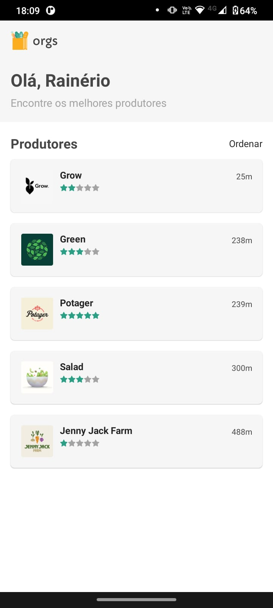

# Projeto Orgs - Utilizando e criando hooks - Alura

Projeto em react native CLI, consiste em uma tela com lista de "empresas" de produtores que podem ser avaliadas com estrelas e ordenadas por distância.  

## **Conceitos aplicados**
> - Estrutura de pastas
> - Criação de componentes
> - Criação de hooks personalizados
> - Mock de dados
> - Flatlist
> - hook useState
> - hook useEffect
> - hook useReduce
> - Stylesheet

## **Funcionalidades**
> - Cabeçalho de boas vindas
> - Listagem de produtores
> - Avaliação de produtores de 1 a 5 estrelas 
> - Utilização de dados randômicos

## **Funcionalidade Extra**
> - Criado botão para classificar lista por distância.

  
